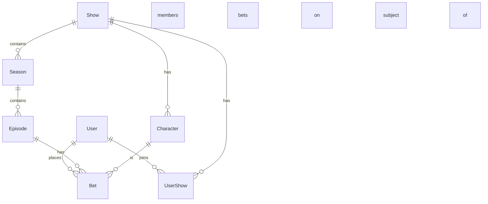
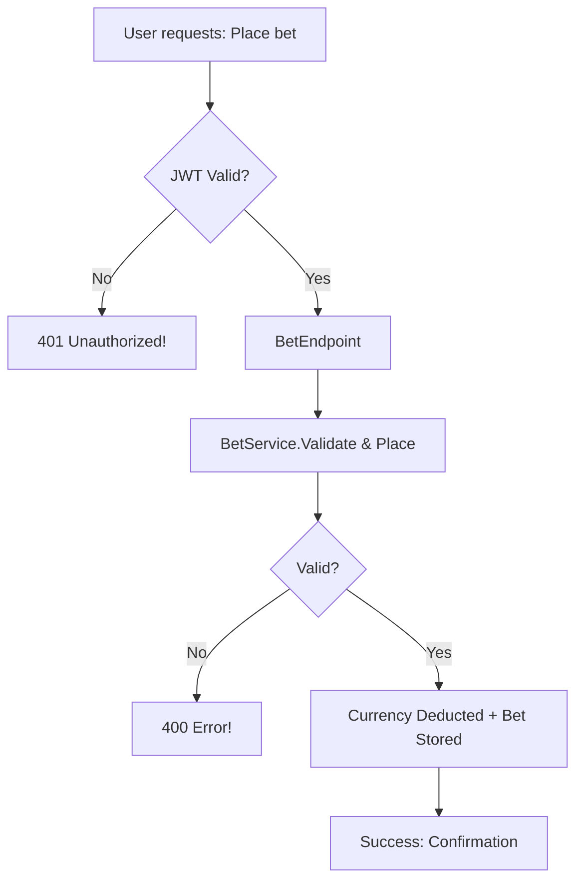

# 🏆 WillTheyDie API

<div align="center">
  
  <h3><em>The gamified API for betting on TV character survival. Will they live? Will they perish? Let your fate-forecasting skills decide!</em></h3>
</div>

---

## 🚀 What is WillTheyDie?

WillTheyDie is a modern, high-performance REST API that turns the art of TV-watching into a competitive prediction game. Users join shows, stack up virtual currency, and bet on which characters will survive each episode. Powered by ASP.NET Core 9, PostgreSQL, and spicy business logic, it's the ultimate platform for anyone who loves drama, plots, and friendly rivalry.

---

## 🎯 Features

- **RESTful API:** Manage users, TV shows, episodes, bets, and characters with beautiful JSON endpoints.
- **Secure & Scalable:** JWT authentication, BCrypt password hashing, HTTPS enforcement, and async/await everything.
- **Multi-Show Mayhem:** Play and bet in multiple shows with isolated virtual wallets.
- **Leaderboards (Coming Soon!):** See who's the psychic, who's the wild guesser, and who's just plain lucky.
- **OpenAPI/Swagger:** Full interactive API docs, always fresh.
- **Enterprise-ready:** Pluggable for hosting on Azure, AWS, or Kubernetes. CI/CD built-in.

---

## 🛠️ Tech Stack

- **Backend:** ASP.NET Core 9 (Minimal APIs)
- **Language:** C# 12
- **ORM:** Entity Framework Core 9 with Npgsql for PostgreSQL
- **Auth:** JWT tokens, BCrypt password hashing
- **Docs:** Swagger/OpenAPI
- **Deployment:** Docker, Kubernetes, or App Service

---

## 💡 Architectural Highlights

> See [`architecture.md`](architecture.md) for diagrams and deep-dive rationale!

- **Layered C4 Pattern**: Clean separation → API Endpoints → Services → Data Access → PostgreSQL
- **Minimal API endpoints & DTOs**: Less boilerplate, more action!
- **Business logic**: Smart bet validation, atomic currency handling, audit trails
- **Security first**: No plaintext passwords, token expiry checks, strict HTTPS

---

## 📝 Quickstart

**Clone it, build it, run it, bet on it:**

```shell
git clone https://github.com/rbmathis/wtd-api.git
cd wtd-api
dotnet restore
dotnet ef database update           # create DB schema
dotnet run
```

**Swagger UI:** By default, visit [`http://localhost:5000/swagger`](http://localhost:5000/swagger) after running.

---

## 🛡️ Security

- BCrypt password hashing by default
- JWT bearers for stateless auth
- All sensitive endpoints are protected
- Follows OWASP top 10 guidelines, see [`architecture.md`](architecture.md#security-considerations).

---

## 📊 Data Model Preview



**Currency per show! Bets per episode! Death awaits!**

---

## 🌐 API Overview

- `/api/auth` ― Login/Register (JWT out, password in)
- `/api/shows` ― Browse, join, view your balance
- `/api/characters` ― Who's on the chopping block
- `/api/episodes` ― Episode info, betting status
- `/api/bets` ― Place, view, audit, confirm!

**Swagger Spec:** Check out the docs for all supported endpoints.

---

## 🔥 Example Bets Flow



---

## ⚡ Performance & Scaling

- DB indexing and async everything
- Designed for containers & cloud
- Ready for caching, real-time (SignalR incoming), and scale-out

---

## 📦 Deployment

- **Docker-native**
- **CI/CD with GitHub Actions**
- **Ready for Azure/AWS/Kubernetes**

---

## 🕹️ Future Roadmap

- **Real-time leaderboard:** WebSocket/SignalR
- **Analytics & ML predictions:** Who will die next?
- **Social features:** Betting leagues, private groups, achievements

---

## 🧠 Documentation & References

- [architecture.md](architecture.md) ― Full deep-dive with diagrams & decisions!
- ASP.NET Core: [Official Docs](https://learn.microsoft.com/aspnet/core/)
- EF Core: [Official Docs](https://learn.microsoft.com/ef/core/)
- PostgreSQL: [Official Docs](https://www.postgresql.org/docs/)
- JWT: [jwt.io](https://jwt.io/)
- OWASP: [Top 10](https://owasp.org/www-project-top-ten/)

---

## 💬 Contributing

This repo welcomes issues, ideas, PRs, bugfixes, and spicy feature suggestions. Open your bets, open your PRs, and let's build the wildest TV death pool in the land!

---

<div align="center" style="font-size:1.2em;">
  <strong>WillTheyDie API</strong> • <em>Let your fate-calling powers fly!</em> 🍿
</div>
