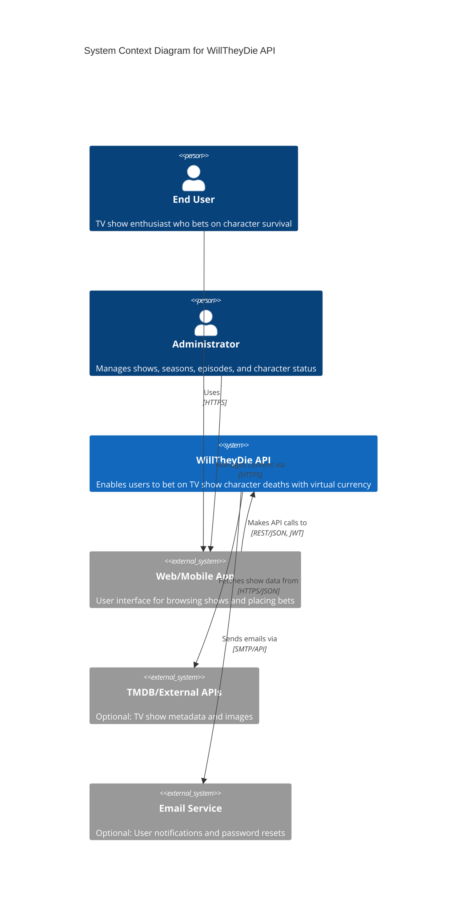
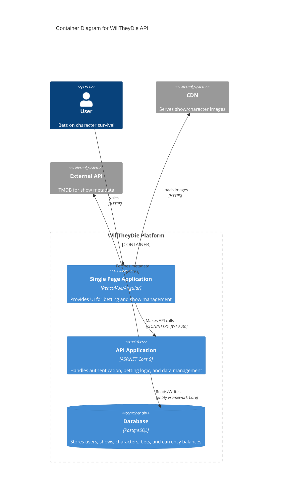
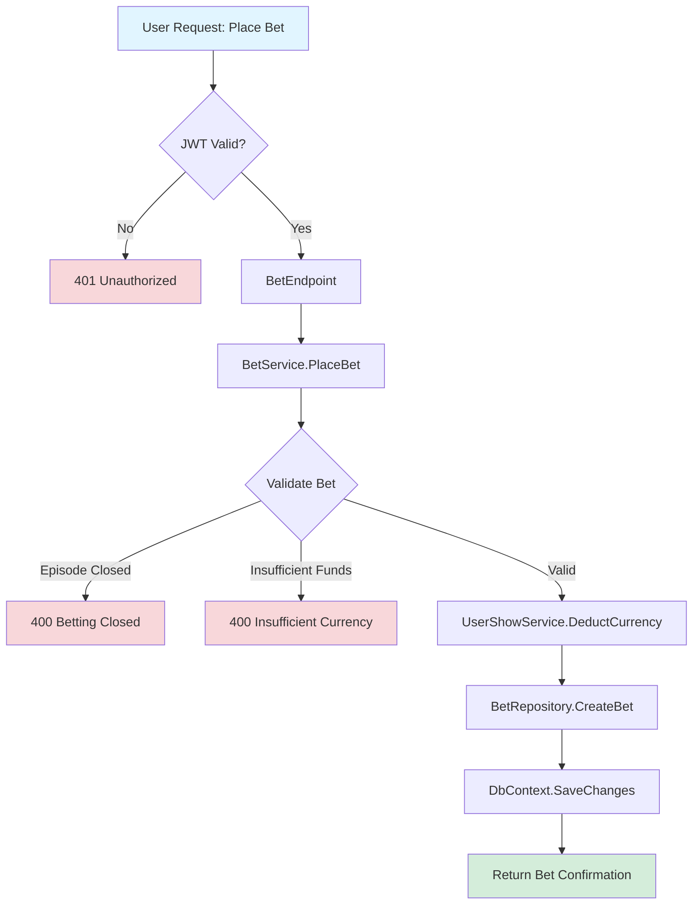
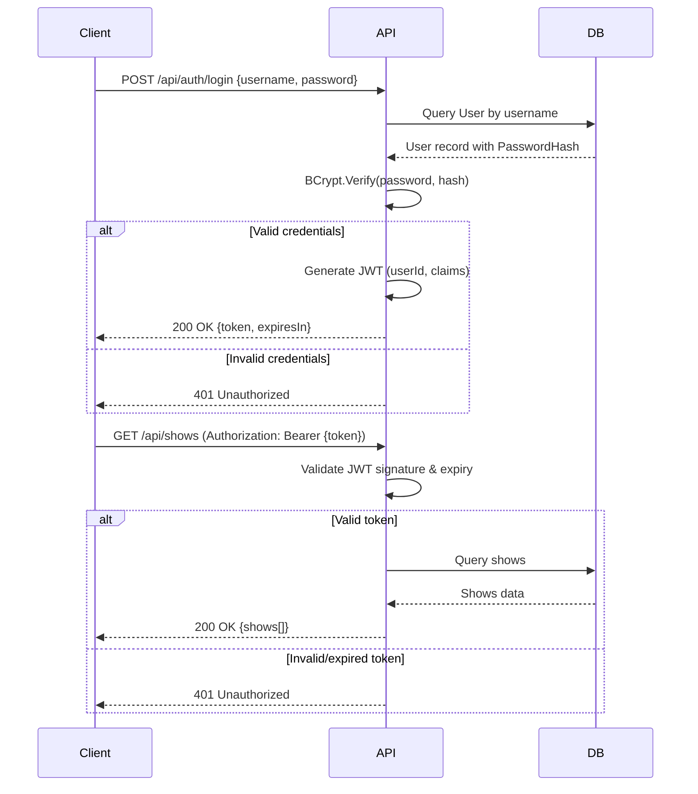
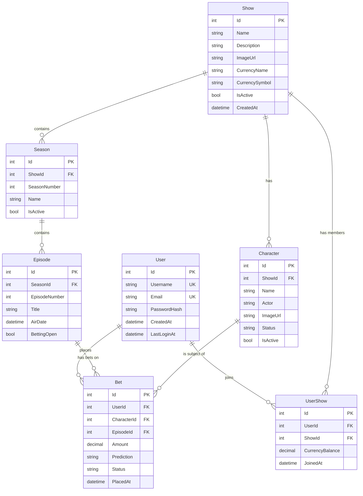
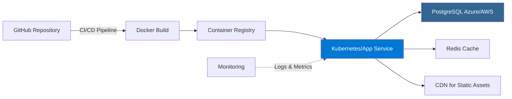

# 🏗️ WillTheyDie API - Architecture Documentation

## 📋 Overview

**WillTheyDie** is a gamified prediction platform API that allows users to bet on character survival in TV shows. Users join shows with virtual currency balances, place bets on whether characters will die in specific episodes, and track their predictions across seasons and episodes.

### Goals
- Provide a robust RESTful API for managing TV shows, characters, episodes, and user bets
- Enable secure user authentication and authorization with JWT tokens
- Support multi-show participation with isolated virtual currency per show
- Track character status changes and betting outcomes
- Scale efficiently with PostgreSQL as the persistence layer

---

## 🛠️ Tech Stack & Dependencies

### Core Framework
- **ASP.NET Core 9.0** - Modern, high-performance web framework with minimal API support and excellent cross-platform capabilities
- **C# 12** with nullable reference types enabled - Type safety and modern language features

### Data Layer
- **Entity Framework Core 9.0.0** - ORM for seamless database access with LINQ support and migrations
- **Npgsql.EntityFrameworkCore.PostgreSQL 9.0.2** - PostgreSQL provider for EF Core, chosen for robust relational data handling and JSON support
- **PostgreSQL** (implied) - Production-grade RDBMS with excellent performance for complex queries and transactions

### Security
- **Microsoft.AspNetCore.Authentication.JwtBearer 9.0.0** - Industry-standard JWT authentication for stateless API security
- **BCrypt.Net-Next 4.0.3** - Password hashing with adaptive cost factor for future-proof security

### API Documentation
- **Microsoft.AspNetCore.OpenApi 9.0.11** - OpenAPI/Swagger specification generation for API discoverability
- **Microsoft.EntityFrameworkCore.Design 9.0.0** - Design-time tooling for EF Core migrations

### Key Technology Decisions
- **PostgreSQL over NoSQL** - Complex relational data (users, shows, seasons, episodes, bets) benefits from ACID transactions and referential integrity
- **JWT over Session-based auth** - Stateless authentication enables horizontal scaling and API-first architecture
- **BCrypt over PBKDF2/Argon2** - Proven, simple, and adaptive hashing algorithm with excellent .NET support
- **Minimal APIs over Controllers** - Reduced boilerplate for lightweight endpoint definitions (based on Program.cs structure)
- **EF Core over Dapper** - Rich ORM features, change tracking, and migrations outweigh raw SQL performance for this domain

---

## 🎯 High-Level Architecture

### Layered Architecture Pattern

```
┌─────────────────────────────────────────┐
│         Client Applications             │
│   (Web, Mobile, Third-party Apps)       │
└────────────────┬────────────────────────┘
                 │ HTTPS/JSON
┌────────────────▼────────────────────────┐
│          API Gateway Layer              │
│  (HTTPS Redirect, CORS, Auth Middleware)│
└────────────────┬────────────────────────┘
                 │
┌────────────────▼────────────────────────┐
│         Endpoints Layer                 │
│  (Minimal API Routes - RESTful)         │
│  /api/auth, /api/shows, /api/bets       │
└────────────────┬────────────────────────┘
                 │
┌────────────────▼────────────────────────┐
│        Services Layer                   │
│  (Business Logic, Validation)           │
│  AuthService, BetService, ShowService   │
└────────────────┬────────────────────────┘
                 │
┌────────────────▼────────────────────────┐
│         Data Access Layer               │
│     (EF Core DbContext, Repositories)   │
└────────────────┬────────────────────────┘
                 │
┌────────────────▼────────────────────────┐
│       PostgreSQL Database               │
│  (Shows, Characters, Bets, Users)       │
└─────────────────────────────────────────┘
```

### Core Components

#### 1. **API Layer (ASP.NET Core 9)**
- Minimal API endpoints for RESTful operations
- JWT bearer token authentication middleware
- OpenAPI/Swagger documentation
- Request/response DTOs for data transfer

#### 2. **Domain Models**
- `User` - User accounts with credentials and login tracking
- `Show` - TV shows with custom currency configuration
- `Season` - Organizational unit within shows
- `Episode` - Individual episodes with betting windows
- `Character` - Characters with survival status tracking
- `UserShow` - Many-to-many relationship with currency balance per user per show
- `Bet` - User predictions on character deaths (referenced but not yet defined)

#### 3. **Data Access (EF Core + PostgreSQL)**
- DbContext for database operations
- Code-first migrations for schema management
- Navigation properties for relational integrity

#### 4. **Security Layer**
- BCrypt password hashing (salt + adaptive cost)
- JWT token generation and validation
- Bearer token authentication on protected endpoints

---

## 🌐 System Context Diagram



---

## 📦 Container Diagram



---

## 🔧 Component Diagram - Betting Flow



### Betting Component Details

**Key Responsibilities:**
1. **Validation Layer**: Ensures episode betting window is open, user has sufficient currency
2. **Transaction Management**: Deducts currency and creates bet atomically
3. **Business Rules**: Enforces one bet per user per character per episode
4. **Audit Trail**: Timestamps all bet placements for integrity

**Data Flow:**
- Endpoint receives JWT-authenticated request
- Service layer validates business rules against database state
- Repository pattern executes transaction
- EF Core tracks changes and commits to PostgreSQL

---

## 🎨 Key Architectural Decisions

### ADR-001: JWT Bearer Tokens for Authentication
**Context:** Need stateless authentication for API scalability  
**Decision:** Use JWT with claims-based authorization  
**Rationale:** 
- Enables horizontal scaling without shared session state
- Industry standard with excellent library support
- Supports future microservices architecture
- Client-side token storage enables offline-first apps

**Consequences:** Requires secure token storage on client; token revocation requires additional logic (blacklist/short expiry)

---

### ADR-002: PostgreSQL as Primary Database
**Context:** Need to model complex relationships (users → shows → seasons → episodes, many-to-many bets)  
**Decision:** PostgreSQL with Entity Framework Core  
**Rationale:**
- ACID transactions critical for currency/betting operations
- Complex joins for leaderboards and statistics
- JSON columns for flexible metadata (future extensibility)
- Battle-tested scalability and performance

**Consequences:** Requires careful indexing strategy; migrations must be managed for schema evolution

---

### ADR-003: BCrypt for Password Hashing
**Context:** User passwords must be securely hashed  
**Decision:** BCrypt with default cost factor (10-12)  
**Rationale:**
- Adaptive cost factor (future-proof against hardware improvements)
- Built-in salt generation
- Proven security track record
- Simple API with BCrypt.Net-Next

**Consequences:** Slower than SHA-256 (intended), requires benchmarking for cost factor tuning

---

### ADR-004: Per-Show Virtual Currency
**Context:** Users participate in multiple shows  
**Decision:** `UserShow` join table with isolated `CurrencyBalance` per show  
**Rationale:**
- Prevents cross-show currency manipulation
- Allows show-specific economy balancing
- Supports custom currency names/symbols per show
- Simplifies bet validation logic

**Consequences:** Requires careful UI design to show context-specific balances; more complex currency management

---

### ADR-005: Minimal APIs over MVC Controllers
**Context:** Need lightweight, performant API endpoints  
**Decision:** ASP.NET Core Minimal APIs (inferred from Program.cs)  
**Rationale:**
- Reduced ceremony and boilerplate
- Excellent performance characteristics
- Modern C# 12 features (records, pattern matching)
- Easy to understand for new developers

**Consequences:** Less opinionated structure; requires discipline for organization

---

## 🔐 Security Considerations

### Authentication Flow


### Security Best Practices Implemented
- ✅ Password hashing with BCrypt (never store plaintext)
- ✅ JWT with expiration claims
- ✅ HTTPS enforcement (UseHttpsRedirection middleware)
- ✅ Nullable reference types (prevent null reference vulnerabilities)
- ⚠️ **TODO**: Rate limiting on auth endpoints
- ⚠️ **TODO**: CORS policy configuration
- ⚠️ **TODO**: Input validation and sanitization
- ⚠️ **TODO**: SQL injection prevention via parameterized queries (EF Core default)

---

## 📊 Data Model Overview



---

## ⚡ Performance Considerations

### Optimization Strategies
1. **Database Indexing**
   - Index on `UserShow(UserId, ShowId)` for fast balance lookups
   - Index on `Bet(EpisodeId, Status)` for bet resolution queries
   - Index on `Character(ShowId, Status)` for active character listings

2. **Query Optimization**
   - Use EF Core's `Include()` for eager loading to prevent N+1 queries
   - Project to DTOs to avoid over-fetching
   - Consider read replicas for leaderboard/statistics queries

3. **Caching Strategy** (Future)
   - Redis for active show/character data
   - Cache JWT public keys for validation
   - Cache leaderboard snapshots with 5-minute TTL

4. **Async/Await**
   - All database operations use async methods
   - Non-blocking I/O for external API calls

---

## 🚀 Deployment Architecture



### Infrastructure Components
- **API Hosting**: Azure App Service / AWS ECS / Kubernetes
- **Database**: Azure PostgreSQL / AWS RDS
- **Caching**: Azure Redis / AWS ElastiCache (future)
- **Monitoring**: Application Insights / CloudWatch
- **CI/CD**: GitHub Actions / Azure DevOps

---

## 🔄 Future Enhancements

### Phase 2 - Real-time Features
- **SignalR** for live bet updates and leaderboard changes
- WebSocket connections for episode watch parties
- Push notifications for episode air dates

### Phase 3 - Analytics
- Data warehouse for historical bet analysis
- ML models for character death probability predictions
- Advanced statistics and user insights

### Phase 4 - Social Features
- Friend lists and private betting leagues
- Social sharing of predictions
- Achievement system and badges

---

## 📚 References & Further Reading

### Official Documentation
- [ASP.NET Core Documentation](https://learn.microsoft.com/aspnet/core/) - Framework reference
- [Entity Framework Core Guide](https://learn.microsoft.com/ef/core/) - ORM patterns and best practices
- [PostgreSQL Documentation](https://www.postgresql.org/docs/) - Database administration
- [JWT.io](https://jwt.io/) - JWT standard and debugger

### Architecture Patterns
- [Microsoft Architecture Guide](https://learn.microsoft.com/azure/architecture/) - Cloud architecture patterns
- [C4 Model](https://c4model.com/) - Software architecture diagramming
- [Domain-Driven Design](https://martinfowler.com/bliki/DomainDrivenDesign.html) - Strategic design patterns

### Security
- [OWASP Top 10](https://owasp.org/www-project-top-ten/) - Web application security risks
- [ASP.NET Core Security Best Practices](https://learn.microsoft.com/aspnet/core/security/) - Framework-specific guidance
- [BCrypt Explained](https://auth0.com/blog/hashing-in-action-understanding-bcrypt/) - Password hashing deep dive

### Tools & Libraries
- [Npgsql Documentation](https://www.npgsql.org/doc/) - PostgreSQL .NET driver
- [BCrypt.Net-Next GitHub](https://github.com/BcryptNet/bcrypt.net) - Library reference
- [Swagger/OpenAPI Specification](https://swagger.io/specification/) - API documentation standard

---

## 📝 Version History

| Version | Date | Author | Changes |
|---------|------|--------|---------|
| 1.0.0 | 2025-12-03 | Architecture Team | Initial architecture documentation |

---

**Document Owner**: Development Team  
**Last Updated**: December 3, 2025  
**Status**: Living Document - Updated as architecture evolves
